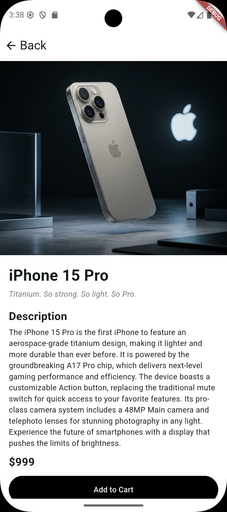
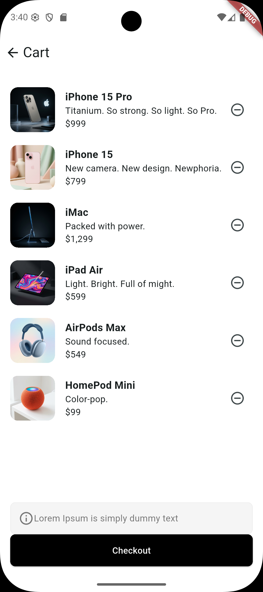

# 📱 Flutter Projesi – Mini Katalog Uygulaması

## 📌 Proje Adı
Flutter Projesi – Mini Katalog Uygulaması

---

## 🧾 Proje Açıklaması
Bu proje Flutter ile geliştirilmiş basit bir mobil katalog uygulamasıdır. Uygulamada ürünler listelenir ve kullanıcılar ürünleri inceleyip sepetlerine ekleyebilir. Proje, Flutter eğitim süreci kapsamında widget yapısı, listeleme, ekranlar arası geçiş ve temel kullanıcı arayüzü geliştirme konularını öğrenmek amacıyla hazırlanmıştır.

---

## 🛠️ Kullanılan Teknolojiler
- Flutter  
- Dart  
- Material Design  

### Flutter Sürümü
Flutter 3.x

---

## 📱 Uygulama Özellikleri
- Ürün listeleme ekranı  
- Ürün detay sayfası  
- Sepete ürün ekleme  
- Sepetteki ürünleri görüntüleme  
- Sayfalar arası geçiş (Navigator)  

---

## 🚀 Projeyi Çalıştırma Adımları

1. Projeyi klonlayın:  

git clone https://github.com/sebanur/Flutter_Projesi.git

2. Proje dizinine girin:

cd flutter_application

3. Gerekli paketleri yükleyin:

flutter pub get

4. Uygulamayı çalıştırın:
flutter run

---

## 📱 Ekran Görüntüleri

### 🏠 Ana Sayfa | 📦 Ürün Detay | 🛒 Sepet

<table cellspacing="10">
  <tr>
    <td></td>
    <td></td>
    <td></td>
  </tr>
</table>

---

## 🎯 Proje Amacı

Bu proje Flutter mobil uygulama geliştirme eğitiminde öğrenilen bilgilerin pekiştirilmesi amacıyla hazırlanmıştır. Projede temel Flutter widget yapıları, listeleme işlemleri ve kullanıcı arayüzü tasarımı kullanılmıştır.
